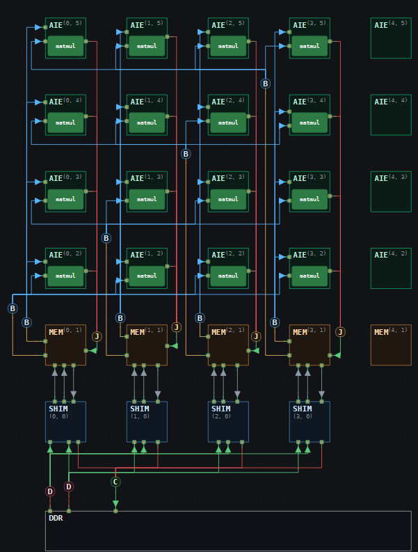
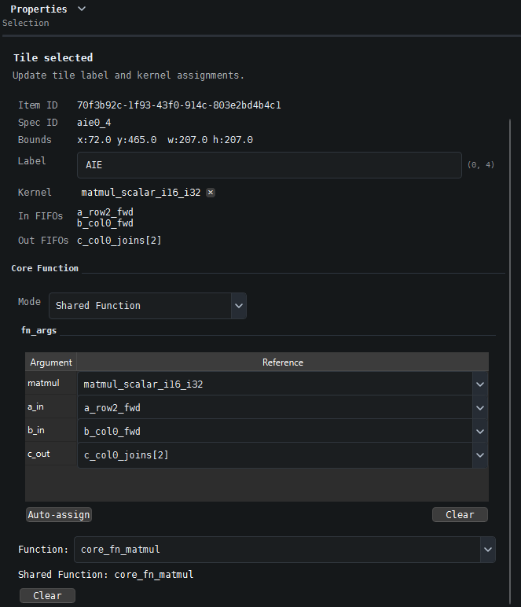

# Workshop: 16-Tile Matrix Multiplication in IRONSmith

`C = A @ B` — 256×128 · 128×128 → 256×128, int16×int16→int32

## How the multiply is split across the grid

The 16 compute tiles form a 4×4 grid of output chunks — 4 grid columns × 4 grid rows of compute tiles (rows 2–5). Each compute tile owns one 64×32 chunk of `C` and nothing else.

- **All 4 tiles in a compute row** share the same 64-row chunk of `A` — that row's 64×128 horizontal strip is broadcast across the row.
- **All 4 tiles in a compute column** share the same 32-column chunk of `B` — that column's 128×32 vertical strip is broadcast down the column.
- Each tile has both its `A` row-chunk and `B` column-chunk, so it computes its own 64×32 chunk of `C` independently of every other tile — accumulating over `K=128` in two 64-wide passes.
- The 4 tiles in a compute column each finish a different 64-row band of the same 32-column output strip. Joining them stacks those 4 bands into one full 256×32 column of `C`, which drains straight to DDR.


---

## 0. Install IRONSmith

1. Download `IRONSmith-Windows.zip` from **[download link]**.
2. Right-click the zip → **Extract All...** and pick a destination folder (e.g. `Downloads\IRONSmith-Windows`).
3. Open the extracted folder and double-click **`IRONSmith.bat`** to launch.

The app opens into a `workspace` folder containing `Example_Designs` (ready-made designs, including the finished 16-tile GEMM) and `sandbox_designs` (empty — save your own work here).

---

## 1. New Design

1. In the **Project Explorer** (left sidebar), you should already see `Example_Designs` and `sandbox_designs`. If not, use **Open Folder** and browse to the `workspace` folder inside your extracted IRONSmith download.
2. Top Ribbon → Home tab → **New Design**
3. Name: `my_gemm`
4. Device Family: `AI Engine-ML`
5. Location: `sandbox_designs/`
6. Click **Create Design**
7. Open the **AIE** panel (right sidebar) → Layout group → set **Horizontal spacing** to `70` and **Vertical spacing** to `65`

---

## 2. Define Symbols
Open the **Symbols** panel (right sidebar).

### New Constant ×6
Click **New Constant** for each:

| Name | Value |
|---|---|
| M | 256 |
| K | 128 |
| N | 128 |
| m | 64 |
| k | 64 |
| n | 32 |

### New Type ×7
Click **New Type** for each. Rank = 1 every time.

| Name | Dimensions | DType |
|---|---|---|
| A_ty | M * K | int16 |
| B_ty | K * N | int16 |
| C_ty | M * N | int32 |
| a_tile_ty | m * k | int16 |
| b_tile_ty | k * n | int16 |
| c_tile_ty | m * n | int32 |
| c_col_ty | M * n | int32 |

### New TAP ×12
Click **New TAP** for each. Format = `TensorAccessPattern`.
For the 8 A/B fills, click **+** once to add a third Sizes/Strides row.

Create one for each, then click duplicate and change the name and offset since the sizes and strides stay the same for each.

**A row fills** — Rows=256, Columns=128:

| Name | Offset | Sizes / Strides (top→bottom) |
|---|---|---|
| of_in_a_row0_tap | 0 | (2, 64), (64, 128), (64, 1) |
| of_in_a_row1_tap | 8192 | (2, 64), (64, 128), (64, 1) |
| of_in_a_row2_tap | 16384 | (2, 64), (64, 128), (64, 1) |
| of_in_a_row3_tap | 24576 | (2, 64), (64, 128), (64, 1) |

**B col fills** — Rows=128, Columns=128:

| Name | Offset | Sizes / Strides (top→bottom) |
|---|---|---|
| of_in_b_col0_tap | 0 | (2, 8192), (64, 128), (32, 1) |
| of_in_b_col1_tap | 32 | (2, 8192), (64, 128), (32, 1) |
| of_in_b_col2_tap | 64 | (2, 8192), (64, 128), (32, 1) |
| of_in_b_col3_tap | 96 | (2, 8192), (64, 128), (32, 1) |

**C col drains** — Rows=256, Columns=128 (2 rows only, no `+`):

| Name | Offset | Sizes / Strides |
|---|---|---|
| of_out_c_col0_tap | 0 | (256, 128), (32, 1) |
| of_out_c_col1_tap | 32 | (256, 128), (32, 1) |
| of_out_c_col2_tap | 64 | (256, 128), (32, 1) |
| of_out_c_col3_tap | 96 | (256, 128), (32, 1) |

---

## 3. Connect Dataflow

See the reference image at the end of this section for what the fully wired result should look like.

### DDR Transfers
Top Ribbon → Home tab → **DDR Transfers**. Click the **DDR tile first**, then each shim tile in turn.

If the 12 wires converging on the DDR tile need more room, select the DDR tile and use the **AIE** panel (right sidebar) → nudge step down to move it further from the shim row.

1. **Distribute** — DDR `A` → shim (0,0), (1,0), (2,0), (3,0)
2. **Distribute** — DDR `B` → shim (0,0), (1,0), (2,0), (3,0)
3. **Collect** — DDR `C` → shim (0,0), (1,0), (2,0), (3,0)

### Shim → Mem (input side)
Top Ribbon → Home tab → **Linking** → **FIFO**. Two wires per column, both to the same mem tile:

| ObjectFifo | Shim | Mem |
|---|---|---|
| of_in_a_row0 | (0,0) | (0,1) |
| of_in_a_row1 | (1,0) | (1,1) |
| of_in_a_row2 | (2,0) | (2,1) |
| of_in_a_row3 | (3,0) | (3,1) |
| of_in_b_col0 | (0,0) | (0,1) |
| of_in_b_col1 | (1,0) | (1,1) |
| of_in_b_col2 | (2,0) | (2,1) |
| of_in_b_col3 | (3,0) | (3,1) |

### Mem → Shim (output side)
Top Ribbon → Home tab → **Linking** → **FIFO**

| ObjectFifo | Mem | Shim |
|---|---|---|
| of_out_c_col0 | (0,1) | (0,0) |
| of_out_c_col1 | (1,1) | (1,0) |
| of_out_c_col2 | (2,1) | (2,0) |
| of_out_c_col3 | (3,1) | (3,0) |

For each FIFO above, select it and open the **Properties** panel (right sidebar) to set:
- Name: matches the ObjectFifo (e.g. `of_in_a_row0`)
- Symbol: `a_tile_ty` / `b_tile_ty` (inputs) or `c_col_ty` (outputs)

Cosmetic only, to keep the wiring cleaner to look at: attach broadcasts to the left side (inputs) and joins to the right side (outputs) of each mem/compute tile.

### Broadcast — Mem → AIE
Top Ribbon → Home tab → **Movement Patterns** → **Broadcast**. Click the **Mem tile first**, then each AIE tile in turn.

**A rows:**

| Source | Mem | → AIE tiles |
|---|---|---|
| A row 0 | (0,1) | (0,2), (1,2), (2,2), (3,2) |
| A row 1 | (1,1) | (0,3), (1,3), (2,3), (3,3) |
| A row 2 | (2,1) | (0,4), (1,4), (2,4), (3,4) |
| A row 3 | (3,1) | (0,5), (1,5), (2,5), (3,5) |

**B columns:**

| Source | Mem | → AIE tiles |
|---|---|---|
| B col 0 | (0,1) | (0,2), (0,3), (0,4), (0,5) |
| B col 1 | (1,1) | (1,2), (1,3), (1,4), (1,5) |
| B col 2 | (2,1) | (2,2), (2,3), (2,4), (2,5) |
| B col 3 | (3,1) | (3,2), (3,3), (3,4), (3,5) |

### Join — AIE → Mem
Top Ribbon → Home tab → **Movement Patterns** → **Join**. Click the Mem tile first, then attach bottom to top, per column:

| Join | Sources | → Mem |
|---|---|---|
| C col 0 | (0,2), (0,3), (0,4), (0,5) | (0,1) |
| C col 1 | (1,2), (1,3), (1,4), (1,5) | (1,1) |
| C col 2 | (2,2), (2,3), (2,4), (2,5) | (2,1) |
| C col 3 | (3,2), (3,3), (3,4), (3,5) | (3,1) |



---

## 4. Assign Kernels

1. Open the **Kernels** panel (left sidebar), search `matmul`
2. Select **GEMM 64x64x32 (INT16 x INT16 -> INT32, scalar)**
3. Click all 16 compute tiles: (0,2)–(3,5)
4. Click **Clear Active Kernel** in the Kernels panel (left sidebar)

---

## 5. Adjust Properties
Select each item below on the canvas, then edit it in the **Properties** panel (right sidebar).

### DDR block → DDR Runtime
Select the DDR block at the bottom of the screen.

**Inputs table:**

| Name | Total Size |
|---|---|
| A | M * K |
| B | K * N |

**Outputs table:**

| Name | Total Size |
|---|---|
| C | M * N |

### Each Distribute/Collect branch wire (12 total) → DDR Transfer
Hover over the wire between the Distribute/Collect hub and the DDR block to see which output (A, B, or C) that branch belongs to. Set each branch's Target FIFO and Tensor Access Pattern:

| Branch | Shim | Target FIFO | Tensor Access Pattern |
|---|---|---|---|
| Distribute A | (0,0) | of_in_a_row0 | of_in_a_row0_tap |
| Distribute A | (1,0) | of_in_a_row1 | of_in_a_row1_tap |
| Distribute A | (2,0) | of_in_a_row2 | of_in_a_row2_tap |
| Distribute A | (3,0) | of_in_a_row3 | of_in_a_row3_tap |
| Distribute B | (0,0) | of_in_b_col0 | of_in_b_col0_tap |
| Distribute B | (1,0) | of_in_b_col1 | of_in_b_col1_tap |
| Distribute B | (2,0) | of_in_b_col2 | of_in_b_col2_tap |
| Distribute B | (3,0) | of_in_b_col3 | of_in_b_col3_tap |
| Collect C | (0,0) | of_out_c_col0 | of_out_c_col0_tap |
| Collect C | (1,0) | of_out_c_col1 | of_out_c_col1_tap |
| Collect C | (2,0) | of_out_c_col2 | of_out_c_col2_tap |
| Collect C | (3,0) | of_out_c_col3 | of_out_c_col3_tap |

Annotations on each wire should read something like `FILL: of_in_a_row0` or `DRAIN: of_out_c_column0`.


### Each Broadcast (8 total) — click the hub
For each broadcast hub, set the name and source FIFO in the Properties panel (right sidebar).

| Hub at | Name | Source FIFO |
|---|---|---|
| (0,1) | a_row0_fwd | of_in_a_row0 |
| (1,1) | a_row1_fwd | of_in_a_row1 |
| (2,1) | a_row2_fwd | of_in_a_row2 |
| (3,1) | a_row3_fwd | of_in_a_row3 |
| (0,1) | b_col0_fwd | of_in_b_col0 |
| (1,1) | b_col1_fwd | of_in_b_col1 |
| (2,1) | b_col2_fwd | of_in_b_col2 |
| (3,1) | b_col3_fwd | of_in_b_col3 |

Each Mem tile hosts two broadcast hubs — one row source, one column source. Match by Source FIFO, not by which tile you clicked.

### Each Join hub (4 total) — click the hub → Join
For each join hub, set the name, offsets, branch type, and destination FIFO in the Properties panel (right sidebar) (this might be auto-detected).

| Hub at | Name | Offsets | Branch Type | Destination |
|---|---|---|---|---|
| (0,1) | c_col0_joins | 0, m * n, 2 * m * n, 3 * m * n | c_tile_ty | of_out_c_col0 |
| (1,1) | c_col1_joins | 0, m * n, 2 * m * n, 3 * m * n | c_tile_ty | of_out_c_col1 |
| (2,1) | c_col2_joins | 0, m * n, 2 * m * n, 3 * m * n | c_tile_ty | of_out_c_col2 |
| (3,1) | c_col3_joins | 0, m * n, 2 * m * n, 3 * m * n | c_tile_ty | of_out_c_col3 |

---

## 6. Build the Core Function

### On tile (0,5) — build it once
1. Click tile **(0,5)**
2. In the Properties panel (right sidebar) → Core Function → Mode: **Body Statements (custom)**
3. Click **+** next to **Kernel** → *Add Kernel Parameter* → `matmul`
4. Click **+** next to **Inputs** → *Add Input Parameter* → `a_in`
5. Click **+** next to **Inputs** → *Add Input Parameter* → `b_in`
6. Click **+** next to **Outputs** → *Add Output Parameter* → `c_out`
7. Click **+ Add** and build each body row, top to bottom:

| Type | Fields |
|---|---|
| ACQUIRE | fifo=`c_out`, count=`1`, var=`elem_out` |
| FOR LOOP | var=`i`, count=`m*n` — click **+ Add inside loop**: |
| &nbsp;&nbsp;↳ ASSIGN | target=`elem_out`, index=`i`, value=`0` |
| FOR LOOP | var=`_`, count=`K//k` — click **+ Add inside loop** ×5: |
| &nbsp;&nbsp;↳ ACQUIRE | fifo=`a_in`, count=`1`, var=`elem_a` |
| &nbsp;&nbsp;↳ ACQUIRE | fifo=`b_in`, count=`1`, var=`elem_b` |
| &nbsp;&nbsp;↳ KERNEL CALL | kernel=`matmul`, args=`elem_a, elem_b, elem_out` |
| &nbsp;&nbsp;↳ RELEASE | fifo=`a_in`, count=`1` |
| &nbsp;&nbsp;↳ RELEASE | fifo=`b_in`, count=`1` |
| RELEASE | fifo=`c_out`, count=`1` |

8. In the **fn_args** table, click **Auto-assign** — this maps `matmul` / `a_in` / `b_in` / `c_out` to tile (0,5)'s own connected kernel and fifos (`a_row3_fwd`, `b_col0_fwd`, `join1`). Check that the fifos were assigned correctly to the arguments.
9. Click **Save as Shared…** → Function name: `core_shared_core_fn_matmul`

### On the other 15 compute tiles
1. Click the tile
2. In the Properties panel (right sidebar) → Core Function → Mode: **Shared Function**
3. Function: → `core_shared_core_fn_matmul`
4. Check the **fn_args** table — it auto-fills with this tile's own connected wires. Click **Auto-assign** if any Reference is blank.



Repeat for all remaining tiles: (0,2) (1,2) (2,2) (3,2) (0,3) (1,3) (2,3) (3,3) (0,4) (1,4) (2,4) (3,4) (1,5) (2,5) (3,5)

---

## 7. Generate & Execute

1. Top Ribbon → Output tab → **Verify Design**
2. Top Ribbon → Output tab → **Generate Code**
3. Copy the generated code from the **Code** panel (right sidebar) into the workshop notebook.
4. Directly under the `gui_design_jit(...)` call, insert:

```python
A_mat = A.numpy().astype(np.int64).reshape(M, K)
B_mat = B.numpy().astype(np.int64).reshape(K, N)
expected = (A_mat @ B_mat).astype(np.int32)
actual = C.numpy().reshape(M, N)

if np.array_equal(actual, expected):
    print("PASS: C matches A @ B")
else:
    mismatches = int(np.count_nonzero(actual != expected))
    print(f"FAIL: C does not match A @ B ({mismatches} / {actual.size} elements differ)")
    print(f"actual[:4,:4]   = {actual[:4,:4]}")
    print(f"expected[:4,:4] = {expected[:4,:4]}")
```

5. Run the notebook cell.

Expected output:

```
A[:8] = [0 1 2 3 4 5 6 7]
B[:8] = [0 1 2 3 4 5 6 7]
C[:8] = [   0  448  896 1344 1792 2240 2688 3136]
PASS: C matches A @ B
```