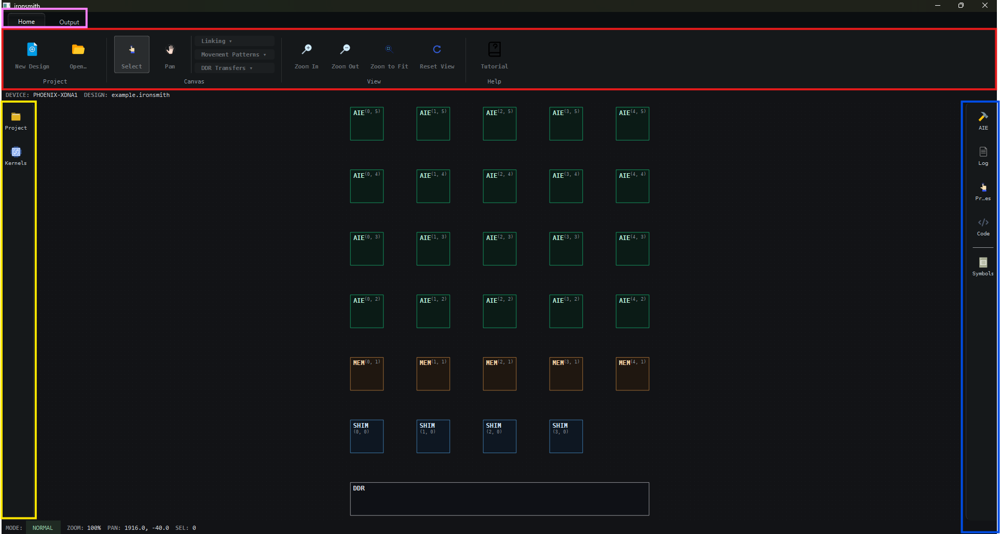
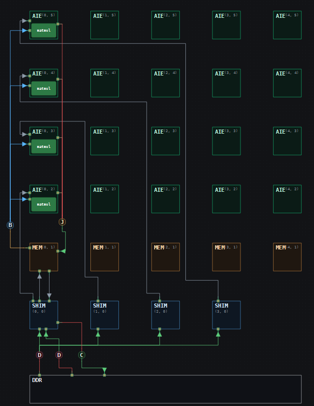

# Short Demo: Single-Column Matrix Multiplication in IRONSmith

`C = A @ B` — 256×128 · 128×32 → 256×32, int16×int16→int32

One compute column (4 AIE tiles) of the [16-tile workshop design](fpl_workshop_guide.md), wired standalone — same tile size, same kernel, same core function.

- `M=256`, `K=128` unchanged — each of the 4 tiles still needs a different 64-row band of the full `A`.
- `N=32` (was 128) — only one grid-column's worth of `B`, shared by all 4 tiles.
- Port limits (shim: 2 in/2 out, mem: 6 in/6 out) mean `A`'s 4 row-chunks stream in across all 4 shims (0,0)–(3,0) straight to their AIE tile, bypassing the mem tile. Only `B` (broadcast) and `C` (join) route through mem (0,1). Shim (0,0) hosts both the `B` fill and the `C` drain.



---

## 0. Open the Design

1. Launch IRONSmith.
2. In the **Project Explorer** (left sidebar), expand `Example_Designs` and open **`single_column_gemm.ironsmith`**.
3. Open the **AIE** panel (right sidebar) → Layout group → set **Horizontal spacing** to `70` and **Vertical spacing** to `65`

---

## 1. Define Symbols
Open the **Symbols** panel (right sidebar).

### New Constant ×6

| Name | Value |
|---|---|
| M | 256 |
| K | 128 |
| N | 32 |
| m | 64 |
| k | 64 |
| n | 32 |

### New Type ×7
Rank = 1 every time.

| Name | Dimensions | DType |
|---|---|---|
| A_ty | M * K | int16 |
| B_ty | K * N | int16 |
| C_ty | M * N | int32 |
| a_tile_ty | m * k | int16 |
| b_tile_ty | k * n | int16 |
| c_tile_ty | m * n | int32 |
| c_col_ty | M * n | int32 |

### New TAP ×6
Format = `TensorAccessPattern`. For the 4 A row fills, click **+** once to add a third Sizes/Strides row.

**A row fills** — Rows=256, Columns=128:

| Name | Offset | Sizes / Strides (top→bottom) |
|---|---|---|
| of_in_a_row0_tap | 0 | (2, 64), (64, 128), (64, 1) |
| of_in_a_row1_tap | 8192 | (2, 64), (64, 128), (64, 1) |
| of_in_a_row2_tap | 16384 | (2, 64), (64, 128), (64, 1) |
| of_in_a_row3_tap | 24576 | (2, 64), (64, 128), (64, 1) |

**B col fill** — Rows=128, Columns=32 (whole array, no offset, 2 rows only, no `+`):

| Name | Offset | Sizes / Strides |
|---|---|---|
| of_in_b_col0_tap | 0 | (128, 32), (32, 1) |

**C col drain** — Rows=256, Columns=32 (whole array, 2 rows only, no `+`):

| Name | Offset | Sizes / Strides |
|---|---|---|
| of_out_c_col0_tap | 0 | (256, 32), (32, 1) |

---

## 2. Connect Dataflow

### DDR Transfers
Top Ribbon → Home tab → **DDR Transfers**. Click the **DDR tile first**, then each shim tile in turn.

1. **Distribute** — DDR `A` → shim (0,0), (1,0), (2,0), (3,0)
2. **Distribute** — DDR `B` → shim (0,0)
3. **Collect** — DDR `C` → shim (0,0)

### Shim → AIE (A rows — bypass the mem tile)
Top Ribbon → Home tab → **Linking** → **FIFO**

| ObjectFifo | Shim | AIE |
|---|---|---|
| of_in_a_row0 | (0,0) | (0,2) |
| of_in_a_row1 | (1,0) | (0,3) |
| of_in_a_row2 | (2,0) | (0,4) |
| of_in_a_row3 | (3,0) | (0,5) |

### Shim → Mem (B input side)
| ObjectFifo | Shim | Mem |
|---|---|---|
| of_in_b_col0 | (0,0) | (0,1) |

### Mem → Shim (C output side)
| ObjectFifo | Mem | Shim |
|---|---|---|
| of_out_c_col0 | (0,1) | (0,0) |

For each FIFO above, select it and open the **Properties** panel (right sidebar) to set:
- Name: matches the ObjectFifo
- Symbol: `a_tile_ty` (A rows) / `b_tile_ty` (B input) or `c_col_ty` (C output)

### Broadcast — Mem → AIE (B only)
Top Ribbon → Home tab → **Movement Patterns** → **Broadcast**. Click the **Mem tile first**, then each AIE tile in turn.

| Source | Mem | → AIE tiles |
|---|---|---|
| B col 0 | (0,1) | (0,2), (0,3), (0,4), (0,5) |

### Join — AIE → Mem
Top Ribbon → Home tab → **Movement Patterns** → **Join**. Click the Mem tile first, then attach bottom to top.

| Join | Sources | → Mem |
|---|---|---|
| C col 0 | (0,2), (0,3), (0,4), (0,5) | (0,1) |



---

## 3. Assign Kernels

1. Open the **Kernels** panel (left sidebar), search `matmul`
2. Select **GEMM 64x64x32 (INT16 x INT16 -> INT32, scalar)**
3. Click all 4 compute tiles: (0,2), (0,3), (0,4), (0,5)
4. Click **Clear Active Kernel** in the Kernels panel (left sidebar)

---

## 4. Adjust Properties

### DDR block → DDR Runtime

**Inputs table:**

| Name | Total Size |
|---|---|
| A | M * K |
| B | K * N |

**Outputs table:**

| Name | Total Size |
|---|---|
| C | M * N |

### Each Distribute/Collect branch wire (6 total) → DDR Transfer

| Branch | Shim | Target FIFO | Tensor Access Pattern |
|---|---|---|---|
| Distribute A | (0,0) | of_in_a_row0 | of_in_a_row0_tap |
| Distribute A | (1,0) | of_in_a_row1 | of_in_a_row1_tap |
| Distribute A | (2,0) | of_in_a_row2 | of_in_a_row2_tap |
| Distribute A | (3,0) | of_in_a_row3 | of_in_a_row3_tap |
| Distribute B | (0,0) | of_in_b_col0 | of_in_b_col0_tap |
| Collect C | (0,0) | of_out_c_col0 | of_out_c_col0_tap |

### The Broadcast hub (1 total) — click the hub

| Hub at | Name | Source FIFO |
|---|---|---|
| (0,1) | b_col0_fwd | of_in_b_col0 |

### The Join hub (1 total) — click the hub → Join

| Hub at | Name | Offsets | Branch Type | Destination |
|---|---|---|---|---|
| (0,1) | c_col0_joins | 0, m * n, 2 * m * n, 3 * m * n | c_tile_ty | of_out_c_col0 |

---

## 5. Build the Core Function

### On tile (0,5) — build it once
1. Click tile **(0,5)**
2. In the Properties panel (right sidebar) → Core Function → Mode: **Body Statements (custom)**
3. Click **+** next to **Kernel** → *Add Kernel Parameter* → `matmul`
4. Click **+** next to **Inputs** → *Add Input Parameter* → `a_in`
5. Click **+** next to **Inputs** → *Add Input Parameter* → `b_in`
6. Click **+** next to **Outputs** → *Add Output Parameter* → `c_out`
7. Click **+ Add** and build each body row, top to bottom:

| Type | Fields |
|---|---|
| ACQUIRE | fifo=`c_out`, count=`1`, var=`elem_out` |
| FOR LOOP | var=`i`, count=`m*n` — click **+ Add inside loop**: |
| &nbsp;&nbsp;↳ ASSIGN | target=`elem_out`, index=`i`, value=`0` |
| FOR LOOP | var=`_`, count=`K//k` — click **+ Add inside loop** ×5: |
| &nbsp;&nbsp;↳ ACQUIRE | fifo=`a_in`, count=`1`, var=`elem_a` |
| &nbsp;&nbsp;↳ ACQUIRE | fifo=`b_in`, count=`1`, var=`elem_b` |
| &nbsp;&nbsp;↳ KERNEL CALL | kernel=`matmul`, args=`elem_a, elem_b, elem_out` |
| &nbsp;&nbsp;↳ RELEASE | fifo=`a_in`, count=`1` |
| &nbsp;&nbsp;↳ RELEASE | fifo=`b_in`, count=`1` |
| RELEASE | fifo=`c_out`, count=`1` |

8. In the **fn_args** table, click **Auto-assign** — maps `matmul` / `a_in` / `b_in` / `c_out` to tile (0,5)'s own kernel and fifos (`of_in_a_row3`, `b_col0_fwd`, `c_col0_joins`).
9. Click **Save as Shared…** → Function name: `core_shared_core_fn_matmul`

### On the other 3 compute tiles
1. Click the tile
2. In the Properties panel (right sidebar) → Core Function → Mode: **Shared Function**
3. Function: → `core_shared_core_fn_matmul`
4. Check the **fn_args** table — click **Auto-assign** if any Reference is blank.

Repeat for: (0,2) (0,3) (0,4)

On every tile, confirm `a_in` references the tile's `of_in_a_rowN` FIFO (Symbol `a_tile_ty`) and `b_in` references `b_col0_fwd` (Symbol `b_tile_ty`) — Auto-assign can swap them once A no longer arrives through the mem tile, and a swap compiles but fails MLIR verification (`memref<4096xi16>` vs `memref<2048xi16>` mismatch) at generate time.

---

## 6. Generate & Execute

1. Top Ribbon → Output tab → **Verify Design**
2. Top Ribbon → Output tab → **Generate Code**
3. Copy the generated code from the **Code** panel (right sidebar) into the workshop notebook.
4. Directly under the `gui_design_jit(...)` call, insert:

```python
A_mat = A.numpy().astype(np.int64).reshape(M, K)
B_mat = B.numpy().astype(np.int64).reshape(K, N)
expected = (A_mat @ B_mat).astype(np.int32)
actual = C.numpy().reshape(M, N)

if np.array_equal(actual, expected):
    print("PASS: C matches A @ B")
else:
    mismatches = int(np.count_nonzero(actual != expected))
    print(f"FAIL: C does not match A @ B ({mismatches} / {actual.size} elements differ)")
    print(f"actual[:4,:4]   = {actual[:4,:4]}")
    print(f"expected[:4,:4] = {expected[:4,:4]}")
```

5. Run the notebook cell.

Verified output:

```
A[:8] = [0 1 2 3 4 5 6 7]
B[:8] = [0 1 2 3 4 5 6 7]
C[:8] = [   0  448  896 1344 1792 2240 2688 3136]
PASS: C matches A @ B
```